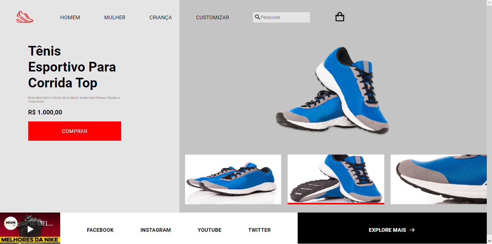

# RocketShoes
## Desafio da rocketseat.
Uma página de loja de tênis estática para prática de HTML, CSS, JavaScript e Responsividade

  

## Tecnologias
- HTML
- CSS
- JavaScript

## Site feito seguindo o design no figma:https://www.figma.com/file/cKinbszeGzF4YTKK4sJfVG/DD-%2F-RocketShoes-(Copy)?node-id=0%3A1
